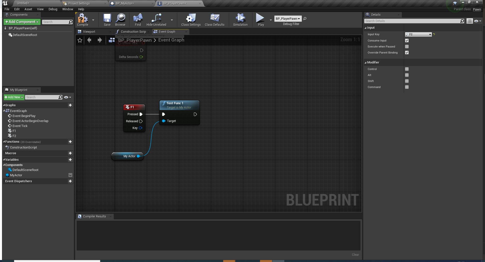
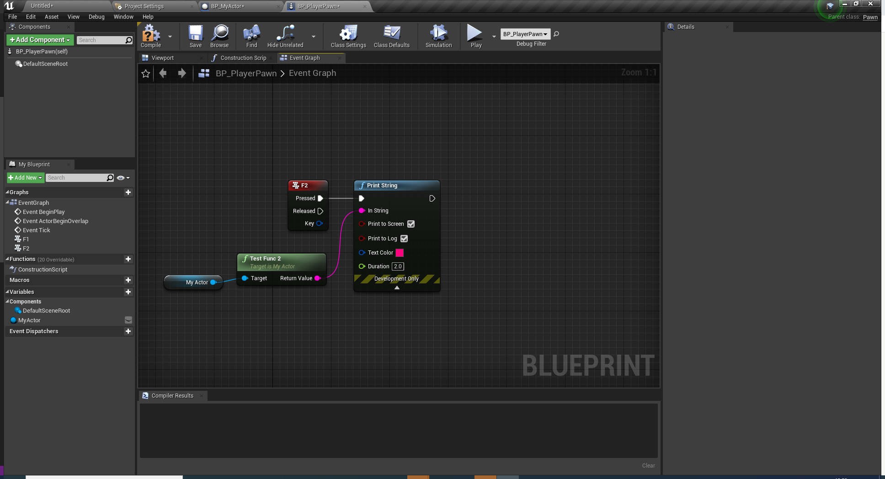
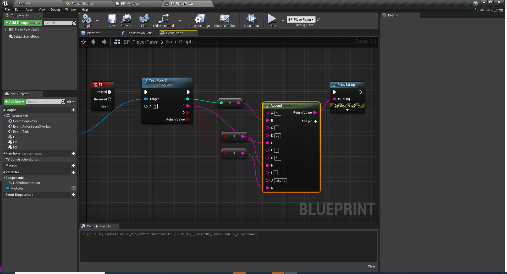

# UnrealEngine4 入門資料

大前提の公式ドキュメント<br>
https://docs.unrealengine.com/ja/index.html
<br>
大前提のAPIリファレンス（英語）<br>
https://docs.unrealengine.com/en-US/API/index.html
<br>
<br>
公式入門用講座サイト  
https://www.unrealengine.com/ja/onlinelearning-courses  
公式が入門から各機能の詳細までの講座動画を配信しているサイト。利用は無料。英語での動画になりますが、大体の動画に日本語字幕ついてるので英語ができる必要はないです。
<br>
EpicGamseアカウントが必要。Google等のアカウントでのサインインも可
<br>
<br>
やったほうがいいだろう講座<br>
### UnrealEngine入門ラーニングパス<br>
https://learn.unrealengine.com/home/LearningPath/92345?r=False&ts=637370909971115327<br>
0からUE4を触るなら最低でもUnrealEngine最初の一時間とUnrealEngine入門のコースだけはやっておいたほうがいいです。それ以降に関しては開発に慣れてからで問題なし
<br>
<br>
0からやるなら公式ドキュメントのUE4を始めようもオススメ<br>
https://docs.unrealengine.com/ja/GettingStarted/index.html
<br>
<br>
### OculusとUnrealEngineを使用したVR開発<br>
https://learn.unrealengine.com/home/LearningPath/117571?r=False&ts=637371106886673095<br>
Oculusと書いてあるが、VRのコンテンツ開発に関して必要な情報が入っている。特に２コース目は最適化の話なのできいておいたほうがいい
<br>
### Unityユーザー向けのUnrealEngine入門
https://www.unrealengine.com/ja/onlinelearning-courses/making-the-switch-from-unity-to-unreal-engine<br>
Unityユーザー向けのコース
<br>
<br>

# UE4 Tips
* Tickは基本殺したほうがいい。使うとしても
  * マネージャのようなものでまとめてアクタで行いたいUpdate関数をぶん回す
  * Tickの更新秒数を遅くする

などの調整を行ったほうがいい
<br>
<br>

# UE4 BluePrint Tips

### よく使う関数一覧<br>
SpawnActorFromClass : アクターをレベル上に生成する。名前の通りActor以下を継承しているクラスのみ<br>
GetActorForward/RightVector : アクターの向きを取得する。<br>

### 変数について
Instance Editable : publicみたいな感じ。<br>
Blueprint Read Only : Constとほぼ同じ<br>
Expose on Spawn : Spawn時に値を初期化できるようになる<br>
Private : privateとほぼ同じ<br>
Expose to Cinematics : シーケンサーのタイムラインから編集可能にする<br>
<br>
# UE4C++Tips
### UFunctionについて
公式ドキュメント<br>
https://docs.unrealengine.com/ja/Programming/UnrealArchitecture/Reference/Functions/index.html<br>
UE4のリフレクションシステムが定義したC++関数を認識できるようにするマクロ<br>
主に使うもの<br>
・BlueprintCallable : ブループリントから呼び出しができるようにする。実行ピンあり<br>

```cpp:BlueprintCallable.cpp
UFUNCTION(BlueprintCallable, Category = "CppTest")
void TestFunc1();
```


<br>
<br>
・BlueprintPure : ブループリントから呼び出しができるようにする。実行ピンなし<br>


```cpp:BlueprintPure.cpp
UFUNCTION(BlueprintPure, Category = "CppTest")
FString TestFunc2();
```



<br>
<br>
<br>
値を返す際、複数の値を返したい場合は下記のように参照渡しの記述をする

```cpp:MultiReturn.cpp
UFUNCTION(BlueprintCallable, Category = "CppTest")
bool TestFunc3(int32 a, int32 &b, FString& c, bool &d);
```


<br>
<br>
### UPropertyについて
公式ドキュメント<br>
https://docs.unrealengine.com/ja/Programming/UnrealArchitecture/Reference/Properties/index.html<br>
使える型の種類などは上記のドキュメントを参考にしてください。<br>
よく使うプロパティ指定子
* BlueprintReadWrite:ブループリント側でプロパティをget/setできるようにする指定子
* BlueprintReadOnly: ブループリント側でプロパティをgetのみできるようにする指定子
* EditAnywhere:エディタ上で初期値の編集をできるようにする指定子。アクターなどの場合、Level上に置いたときにも編集ができるようにする。
* EditDefaultsOnly:エディタ上で初期値の編集をできるようにする指定子。イベントグラフ上でのみ編集可能
* Category:UFUNCTIONと同じ。